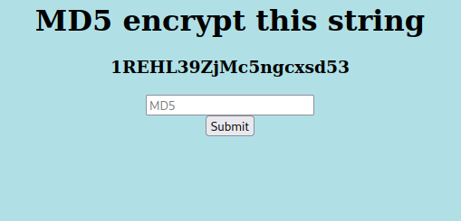
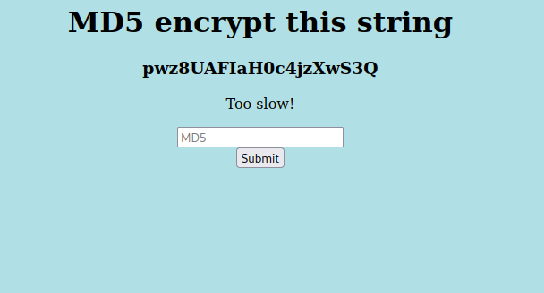
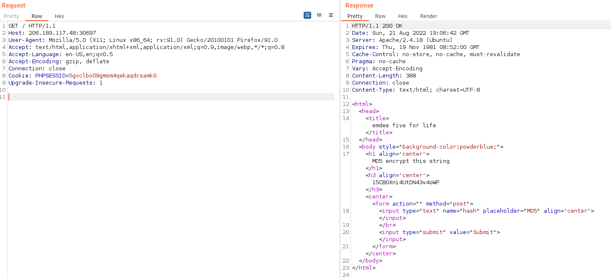
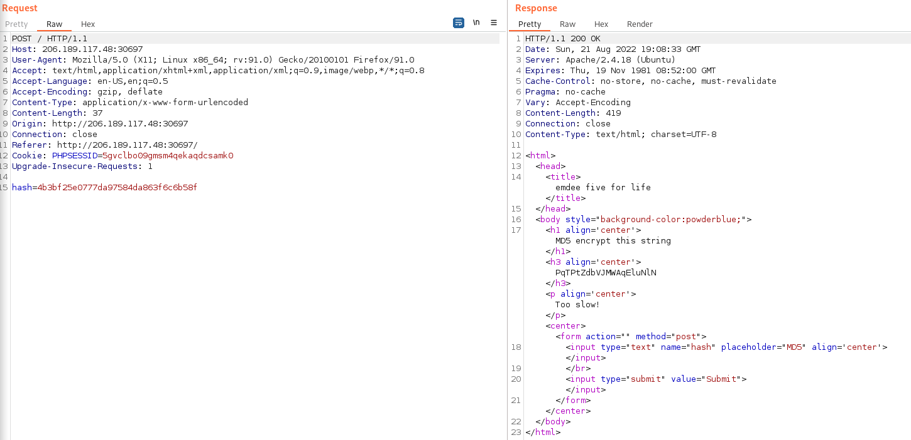

# Hack the Box - Challenge - Emdee five for life
Author: L4mpje
Release Date: May 22, 2019

## Challege Description
Can you encrypt fast enough?

## Tools Used
- Python


## Write Up

You start the instance and you are given a webpage that asks you to MD5 a random string.



Let MD5 the string:

```
$ echo '1REHL39ZjMc5ngcxsd53' | md5sum
91bb5267edf04a74a8a0309bb091f01e  -
```
Looks like we were too slow:



I'm assuming we will have to script the get and post request in order to get the hash to the server fast enough. Lets look at the get request in burp suite:



And now lets look at the post request:



It appears that we can use python to creat a session to capture the string in the h3 tag, md5 hash it and post it back to the server in the hash variable. Hopefully that is fast enough.

```python
import requests
from bs4 import BeautifulSoup
import hashlib

url = 'http://206.189.117.48:30697/'
req = requests.session()

# get request too the webpage and parse out the h3 tag with Beautiful Soup
getx = req.get(url)
bsh = BeautifulSoup(getx.text, 'html.parser')
string2hash = bsh.select('h3')[0].text.strip()

# Hash the string
hashstring = hashlib.md5(string2hash.encode('utf-8')).hexdigest()

# Post the hashed string back to the server
hash = {'hash': hashstring}
x2 = req.post(url, data = hash)

# Print the webserver response
print(x2.text)
```

If we run the python code we get:

```
$ python3 emdeefiveforlife.py
<html>
<head>
<title>emdee five for life</title>
</head>
<body style="background-color:powderblue;">
<h1 align='center'>MD5 encrypt this string</h1><h3 align='center'>FyhHQvh7qwmP3VYXwEGH</h3><p align='center'>HTB{N1********************i!}</p><center><form action="" method="post">
<input type="text" name="hash" placeholder="MD5" align='center'></input>
</br>
<input type="submit" value="Submit"></input>
</form></center>
</body>
</html>

```

There is the flag!

