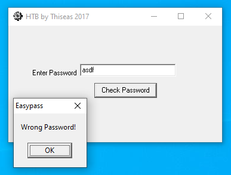
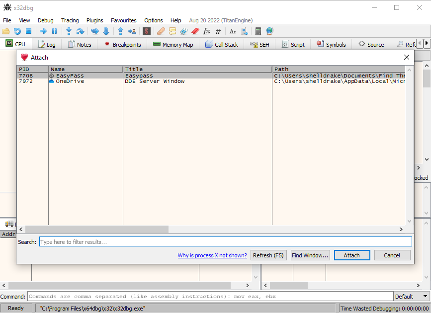
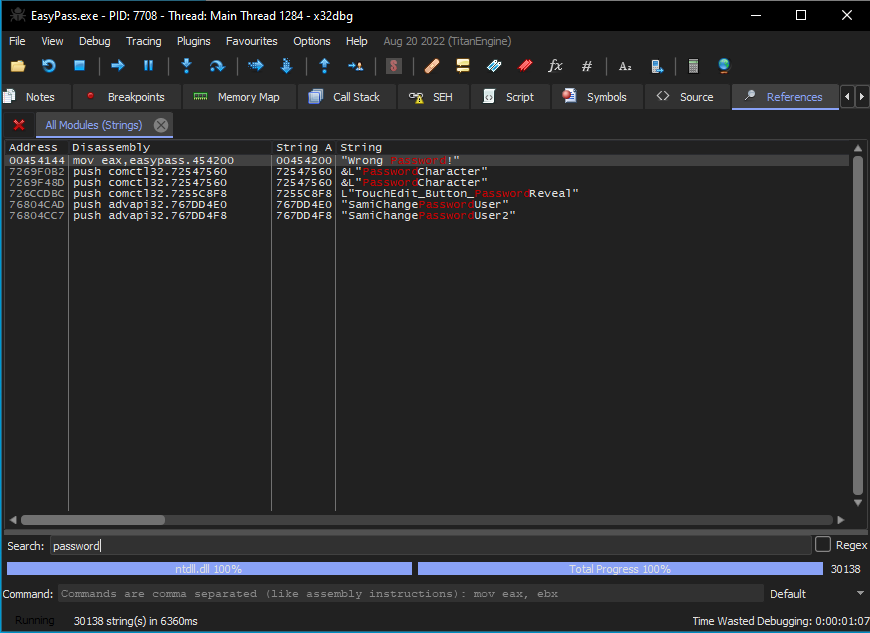
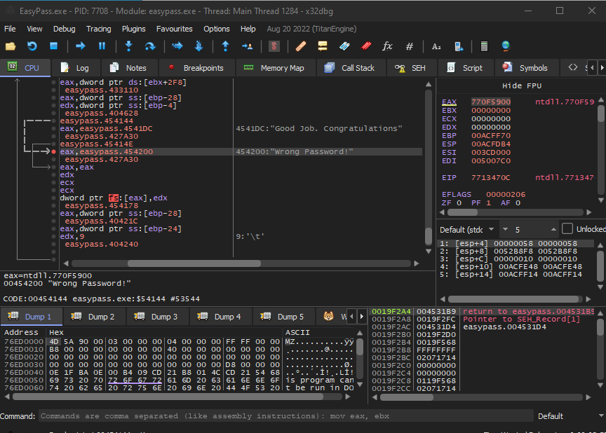
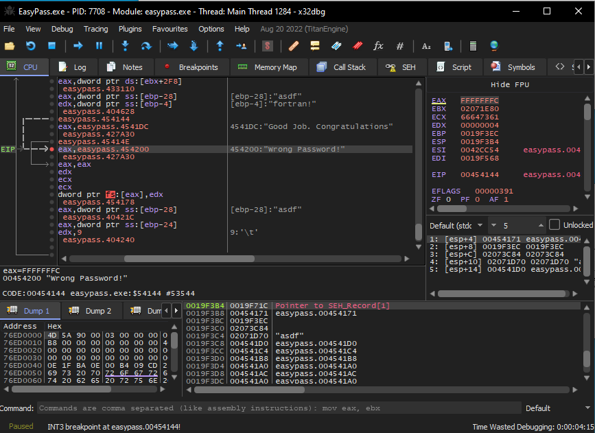
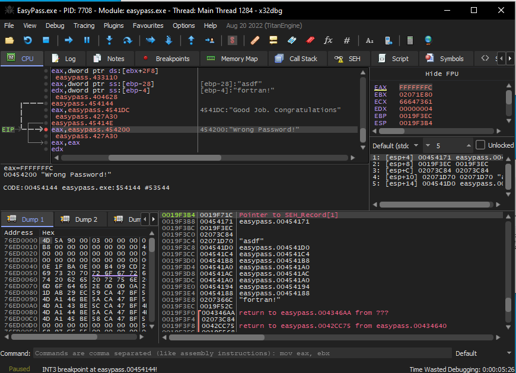
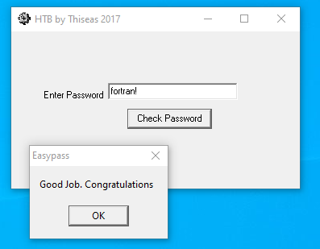

# Hack the Box - Challenge - Find The Easy Pass
Author: alamot 
Release Date: July 4, 2017

## Challege Description
Find the password (say PASS) and enter the flag in the form HTB{PASS}

## Tools Used
- x32dbg

## Write Up

Download and unzip the challenge file and CD into the directory.

Start the program and input a password

Attach to the process

search for "password" string

set a breakpoint, run the program

Browse through the memory near the break point pointer

Potential password in memory

Try that string

There is the flag!

