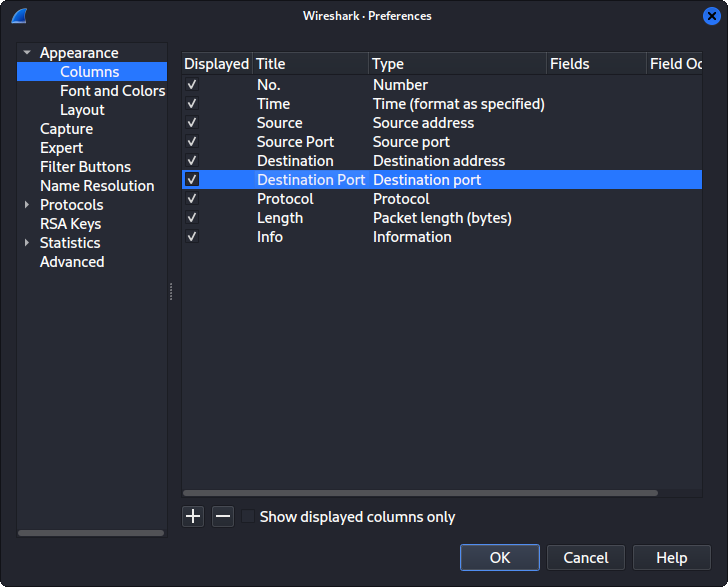
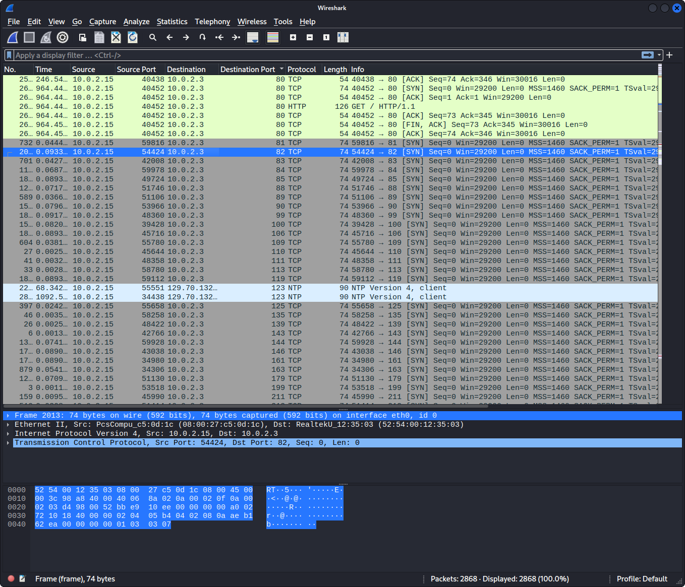
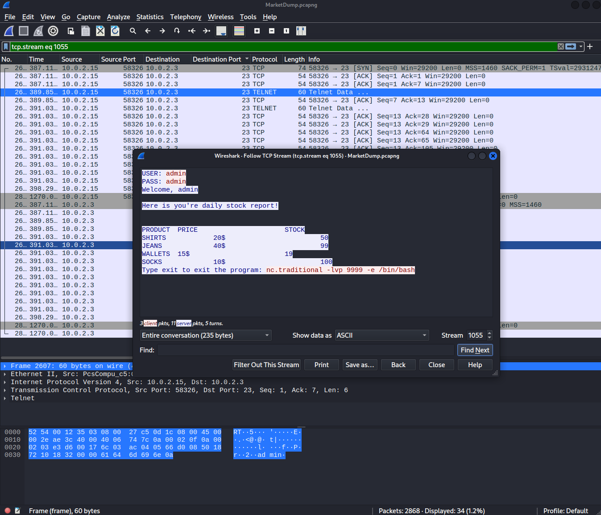
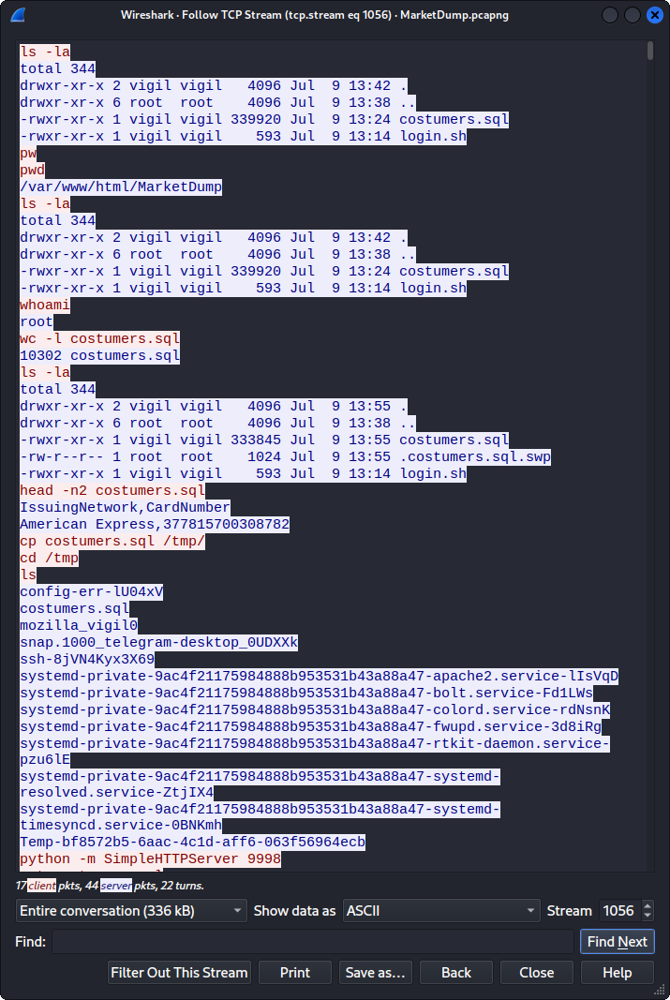
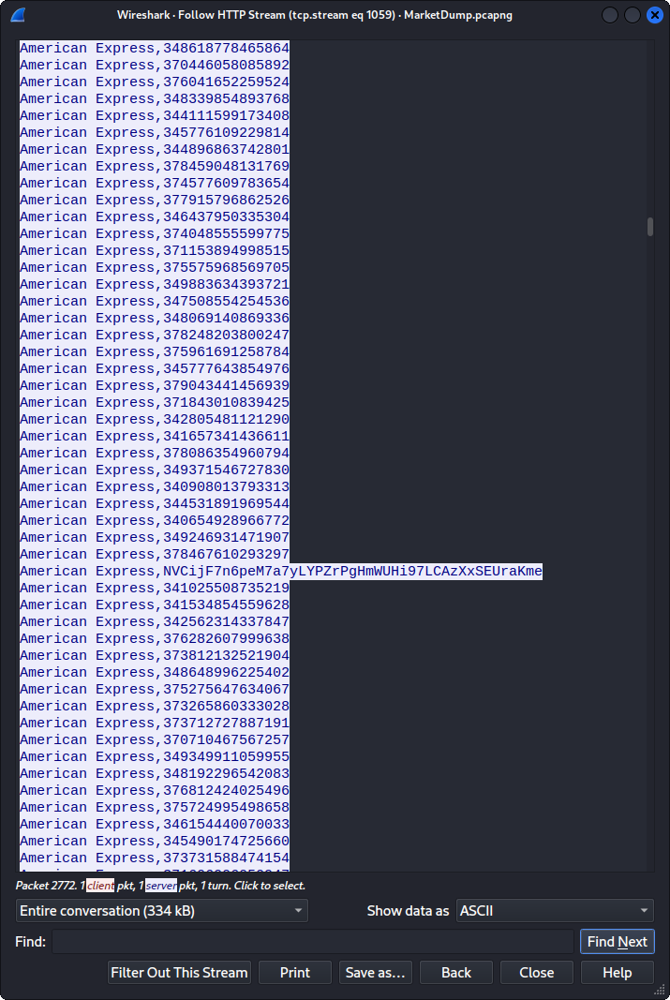
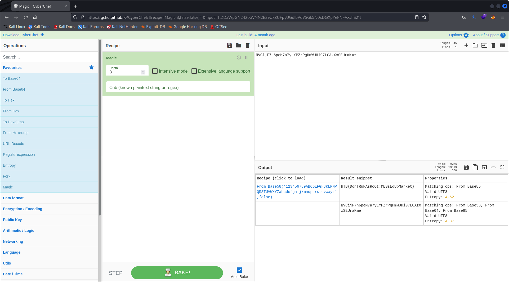

# Hack the Box - Challenge - MarketDump
Author: butrintkomoni  
Release Date: May 16, 2019

## Challege Description
We have got informed that a hacker managed to get into our internal network after pivoiting through the web platform that runs in public internet. He managed to bypass our small product stocks logging platform and then he got our costumer database file. We believe that only one of our costumers was targeted. Can you find out who the customer was?

## Tools Used
- wireshark


## Write Up

Download and unzip the challenge file and CD into the directory:

List files in the directory:

```
$ ls -la
total 1184
drwxr-xr-x  2 shelldrake shelldrake   4096 Aug 19 21:02 .
drwxr-xr-x 25 shelldrake shelldrake   4096 Aug 19 20:52 ..
-rw-------  1 shelldrake shelldrake 966528 Jul  9  2018 MarketDump.pcapng
-rw-r--r--  1 shelldrake shelldrake 236093 Aug 19 21:01 MarketDump.zip

```

Looks like we are given a pcap file. Let's analyze it in wireshark. The packets are presented in order and this can make it difficult to quickly identify what is going on. I like sorting by destination port. But in order to do that you have to add the destination port colummn in the preferences:



Once the pcap is sorted by destination port we can easily identify that a port scan has occured:



We see a lot of telnet traffic on port 23. If we follow the TCP stream we can see that the attacker is looking to have the system open a shell on port 9999.



If we take a look at what happened in the 9999 desitination port we can see the attacked found a costumers.sql file, copied it into the /tmp/ directory and opened a python http server to exfil the data on port 9998.



We can follow the http stream on port 9998 and see the data that was exfilled. It appears to be bunch of credit card, hower one of the credit card numbers stand out and appear to be an encoded string.



We don't know how the data was encode so we can try the cyber chef magic recipe to attempt to detect the decode the string



There is the flag!

