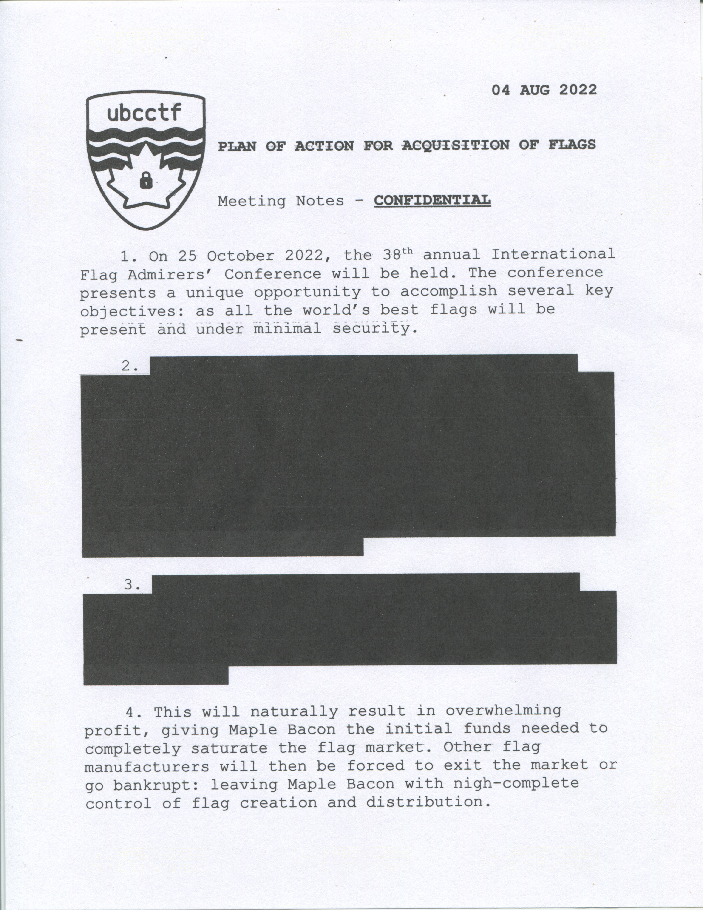
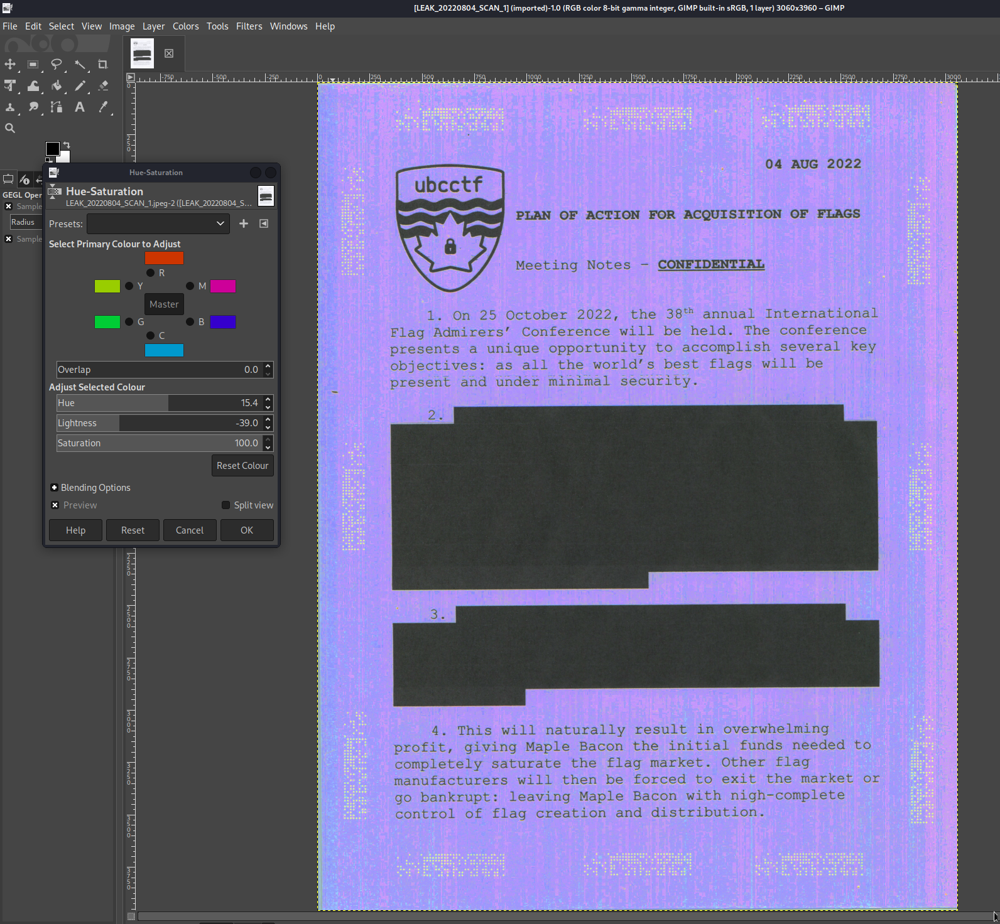
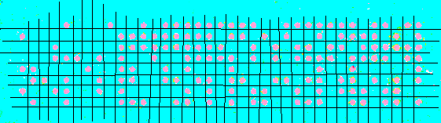
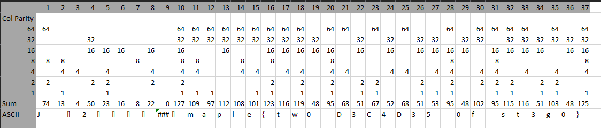

# Maple Bacon CTF 2022 - Misc - Flag Hoarding
Author: Apropos 
Release Date: August 26, 2022

## Challege Description
Damning internal communications within Maple Bacon have been leaked, revealing a plot to steal the flags of other teams at the upcoming International Flag Admirers' Conference. You've gotten a hold of the leaked files. Find information that could help uncover the identity of the whistleblower

## Tools Used
- gimp

## Write Up

You're given a jpeg file:



I tried to see if anything was embeded in the image. It said it was password protected, so I started to bruteforce it with the rockyou wordlist

```
$ steghide info LEAK_20220804_SCAN_1.jpeg
"LEAK_20220804_SCAN_1.jpeg":
  format: jpeg
  capacity: 162.7 KB
Try to get information about embedded data ? (y/n) y
Enter passphrase: 
steghide: could not extract any data with that passphrase!
```

Concurrently, I want to see if there was anything else. I open the image with gimp and played with the colours/hue/saturation to see if there was anything:



Cool some dots showed up. Let see if I can find anything online about it:

[https://www.eff.org/files/filenode/printers/ccc.pdf](https://www.eff.org/files/filenode/printers/ccc.pdf)

Seems similar enough. Lets try to decode it:





There's your flag!

I never finished brute forcing the stego once I found the flag.