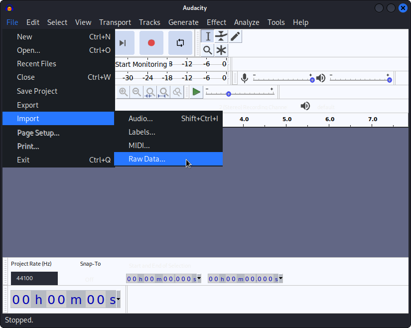
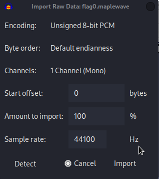
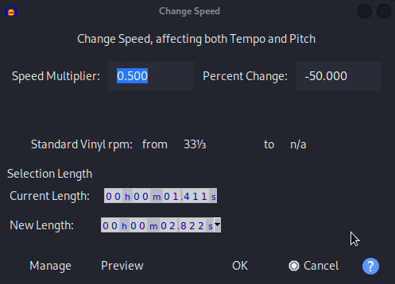
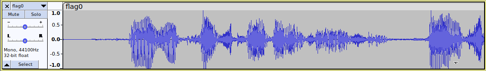

# Maple Bacon CTF 2022 - Rev - maplewave-0
Author: xal#3845 
Release Date: August 26, 2022

## Challege Description
I've recorded some flags using some ancient proprietary software. The floppy disk containing the playback program is lost forever. Can you recover the audio?
Separate the words you hear with spaces and wrap them with maple{}. The flag will match the regex ^maple{([a-z]+ )+[0-9]+}$

## Tools Used
- Audacity

## Write Up


You're given the following files:

```
$ file maplewave      
maplewave: ELF 64-bit LSB pie executable, x86-64, version 1 (SYSV), dynamically linked, interpreter /lib64/ld-linux-x86-64.so.2, BuildID[sha1]=9e70abd82cf7c3a878ce9d9644be1e9034cabcaf, for GNU/Linux 3.2.0, stripped
```

```
$ file flag0.maplewave 
flag0.maplewave: data
```

I decided to import raw data file into Audacity as unsigned 8 bit PCM




It sounds like a chipmunk. Let slow it down:



Thats better!



Theres your flag. Input what you hear in accordance to the regex in the description.